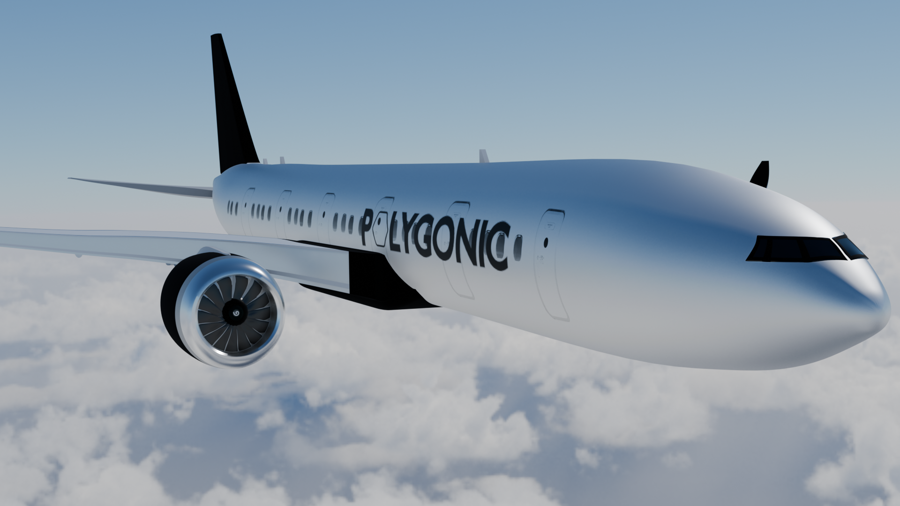

# 777 Airline Livery Model

This repository contains a 3D model of an aircraft, specifically designed for product display purposes related to an airline livery. This model is intended for visualization and demonstration within a controlled environment and is **not** designed for distribution or commercial use.

## Features

- **Detailed Exterior**: The model showcases a detailed exterior with accurate proportions, ideal for high-quality renderings and promotional materials.
- **Customizable Textures**: Includes customizable texture maps for liveries, allowing easy modifications to suit various branding requirements.
- **Optimized for Rendering**: The model is optimized for rendering in software like Blender, ensuring smooth and efficient performance.

## Licensing and Distribution

This model is intended solely for product display and promotional purposes related to airline livery. It is **not associated with Boeing** or any other manufacturer. The model is not available for distribution, resale, or any other commercial use.
